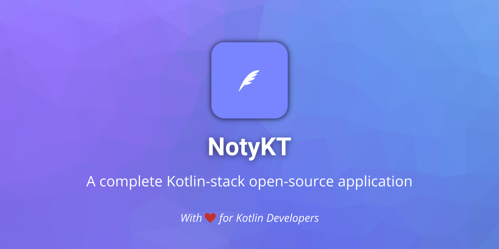

# NotyKT 🖊️ 

/badge.svg) 
/badge.svg)
/badge.svg)


[](LICENSE)
[](https://ktlint.github.io/)
[](https://github.com/PatilShreyas/NotyKT/stargazers)
[](https://github.com/PatilShreyas/NotyKT/network/members)
[](https://github.com/PatilShreyas/NotyKT/watchers)


**NotyKT** is the complete Kotlin-stack note taking 🖊️ application 📱 built to demonstrate a use of Kotlin programming language in *server-side* and *Modern Android development* tools. Dedicated to all Android Developers with ❤️. 

***You can Install and test latest NotyKT Android app from below 👇***

[](https://github.com/patilshreyas/notykt/releases/latest/download/noty-android-simple.apk)
[](https://github.com/patilshreyas/notykt/releases/latest/download/noty-android-compose.apk)

## 📄 Project Documentation

[_**Visit the documentation of this project**_](https://patilshreyas.github.io/NotyKT/) to get more information in detail.

## 💡 About the Project

This project includes two subprojects:

### 🔹 [Noty API](/noty-api)

This is a *REST API* built using Ktor Framework deployed on *Heroku*.  
Navigate to [`/noty-api`](/noty-api) directory to browse and know more about Noty API project.

### 🔹 [Noty Android Application](/noty-android)

This is an Android application which uses *Noty REST API*. It has application UI implementation using traditional *Android's Navigation Architecture* as well as modern *Jetpack 🚀 Compose UI*.  
Navigate to [`/noty-android`](/noty-android) directory to browse and know more about Noty Android project.

## Want to Contribute 🙋‍♂️?

Awesome! If you want to contribute to this project, you're always welcome! See [Contributing Guidelines](CONTRIBUTING.md). You can also take a look at [NotyKT's Project Status Tracker](https://github.com/PatilShreyas/NotyKT/projects/1) for getting more information about current or upcoming tasks.

## Want to discuss? 💬

Have any questions, doubts or want to present your opinions, views? You're always welcome. You can [start discussions](https://github.com/PatilShreyas/NotyKT/discussions).

## Contributors

- [Shreyas Patil](https://github.com/PatilShreyas)
- [Sanju S](https://github.com/Spikeysanju)
- [Pranay Patel](https://github.com/pranaypatel512)

## License

```
Copyright 2020 Shreyas Patil

Licensed under the Apache License, Version 2.0 (the "License");
you may not use this file except in compliance with the License.
You may obtain a copy of the License at

    http://www.apache.org/licenses/LICENSE-2.0

Unless required by applicable law or agreed to in writing, software
distributed under the License is distributed on an "AS IS" BASIS,
WITHOUT WARRANTIES OR CONDITIONS OF ANY KIND, either express or implied.
See the License for the specific language governing permissions and
limitations under the License.
```
