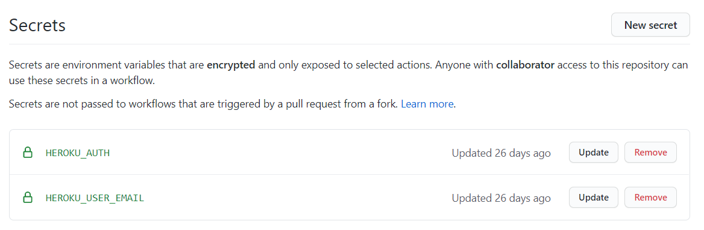

# 🤖 Setup GitHub Actions for Deployment

Follow these steps for setting up automatic deployment to Heroku using GitHub Actions CI which will be triggered on every push on master (main) branch.

## 🔐 Set Secrets on GitHub

You can take a look on [this](https://github.com/PatilShreyas/NotyKT/blob/master/noty-api/GHActionsSecrets.txt) file for exmaple.

- Retrieve Heroku API Auth token

    ```bash
    heroku auth:token
    ```

- Create a secret `HEROKU_AUTH` using following syntax

    ```netrc
    machine api.heroku.com
    login email@example.com
    password AUTH_TOKEN
    machine git.heroku.com
    login email@example.com
    password AUTH_TOKEN
    ```

- Create a secret `HEROKU_USER_EMAIL` and put your email (which is used for Git/Heroku).

After creating secret, it would look like below image.



## 👨‍💻 Set up Workflow

You can take a look at [this](https://github.com/PatilShreyas/NotyKT/blob/master/.github/workflows/deploy_api.yml) workflow file.

- Create a workflow on GitHub by a name let's say `deploy_api.yml`. Add basic structure for it.

```yaml
name: Deploy (API)

on:
  push:
    branches:
      - master
      
    paths:
      - 'noty-api/**'

jobs:
  deploy_api:
    name: Deploy to Heroku
    runs-on: ubuntu-latest
```

?> You can configure it as per your case. (In NotyKT, we created workflow which will deploy API on every push on master branch if changes happens in `noty-api/` directory).

- Add steps for deployment

```yaml
    steps:
      - uses: actions/checkout@v1

      - name: Install Heroku CLI
        run: curl https://cli-assets.heroku.com/install-ubuntu.sh | sh

      - name: Deploy to Heroku
        run: |
          git config --global user.name ${{ github.actor }}
          git config --global user.email ${{ secrets.HEROKU_USER_EMAIL }}
          echo "$HEROKU_AUTH" > ~/.netrc
          heroku git:remote --app noty-api
          git subtree push --prefix noty-api heroku master
        env:
          HEROKU_AUTH: ${{ secrets.HEROKU_AUTH }}
```

That's all! Now just make changes, push and chill. GitHub Actions will do work of deployment.
