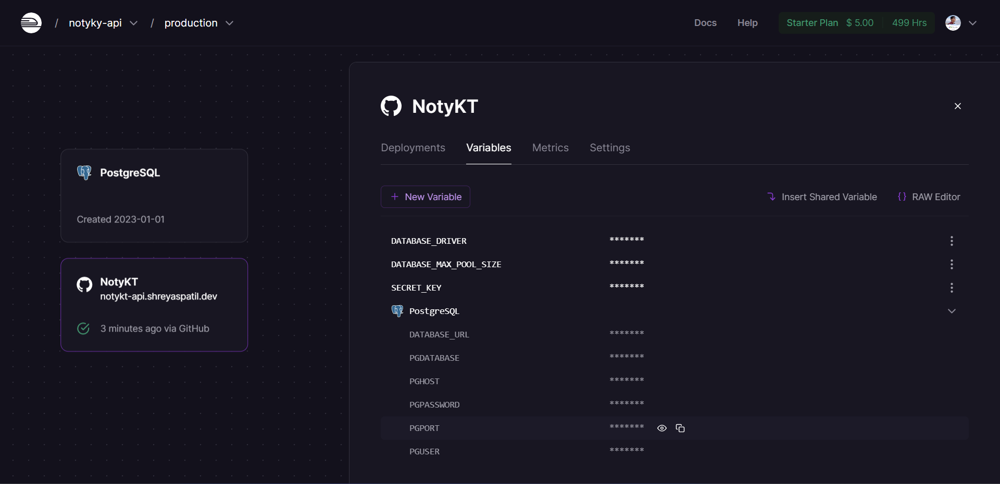

# Deployment on Railway.app

This project is currently deployed on Railway.app on the following URLs
- https://notykt-production.up.railway.app/notes
- https://notykt-api.shreyaspatil.dev

Deployment on Railway is very simple. On every push, it automatically deploys project.



## Deployment Pre-requisites

### Create bundle on Build

Whenever deployment is triggered, it executes Gradle task - `build` which will be responsible for project build generation and then deployment. So make sure to generate artifact on build command itself.

```gradle
build.finalizedBy(installDist)
```
Or use below code if you're using Gradle Kotlin DSL

```kotlin
tasks.getByName("build").finalizedBy("installDist")
```

### Create Procfile

You will also need a Procfile describing what to execute at the time of deployment.

As we set up Gradle task in previous step, whenever Gradle task stage is executed, built application artifacts are generated at the path `application/build/install/application/bin/application`. In the Procfile, just provide the name of the process and the generated executable file.

```Procfile
web: application/build/install/application/bin/application
```

### Configure project on Railway.app

- Create a project on Railway.app (from GitHub).
- Configure deployment branch as `master` and directory `noty-api` (_as API source is in directory_).
- Add PostgreSQL Database service in Railway.app. Steps below
    - Go to https://railway.app/dashboard on a new tab
    - Click on new project (or directly go to https://railway.app/new)
    - Select `Provision PostgreSQL`
- Configure environment variables (_as seen in the above image_, you'll need to create `DATABASE_DRIVER`, `DATABASE_MAX_POOL_SIZE` and `SECRET_KEY` environment variables, rest will be created by railway once you add postgres).
- After this, just deploy and check whether everything is working fine.