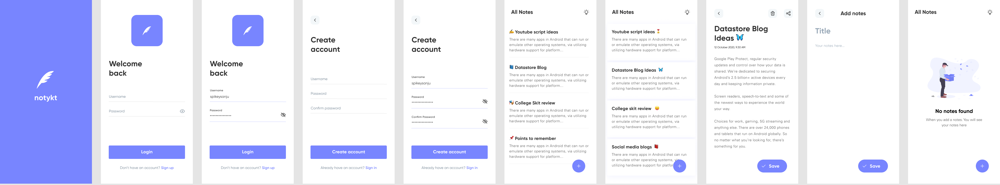
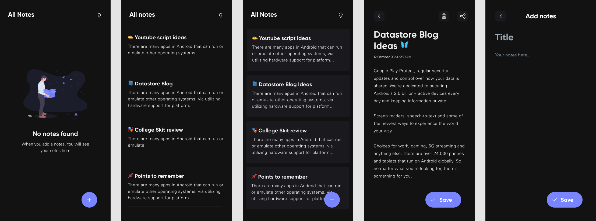
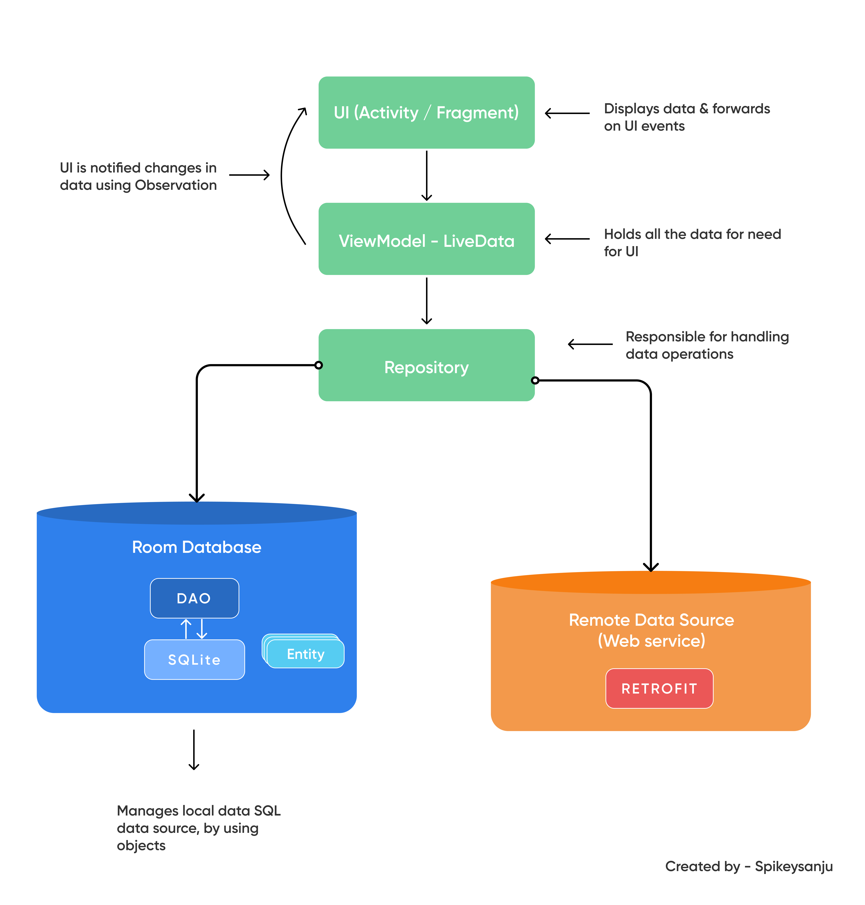

  

# NotyKT (Android) 📱

/badge.svg)

_**Noty Android application**_ is built with _Modern Android application development_ tools or libraries. 
Aim of this project is to showcase Good practice implementation of Android application development with proper architecture design. 
_Dedicated to all Android Developers with_ ❤️.

[📄 _**Visit the documentation of this project**_](https://patilshreyas.github.io/NotyKT/) to get more information in detail.

***You can Install and test latest NotyKT app from below 👇***

## Features  👓

The codebase focuses on following key things:

- [x] Single Activity Design
- [x] Offline Capability - Notes ✈️
- [x] Clean and Simple Material UI 🎨
- [x] Dark mode 🌗
- [x] Jetpack Compose UI
- [x] Tests

## About this project 💡

- Noty Android app is available with _traditional approach using Navigation Architecture_ as well as modern UI development toolkit i.e. _Jetpack Compose UI_.
- There are two submodules in [**`app`**](/app) module as following:
    - [**`:app:simpleapp`**](app/simpleapp): Android Noty UI implementation using [_Navigation Architecture_](https://developer.android.com/guide/navigation/navigation-getting-started) using traditional XML resources.
    - [**`:app:composeapp`**](app/composeapp): Android Noty UI implementation using [_Jetpack Compose UI Toolkit_](https://developer.android.com/jetpack/compose?gclid=Cj0KCQjwreT8BRDTARIsAJLI0KKRX0vsRWcQ-0AC6lCutEWwAB4t1wqWBi2MclQqm96gnSddahFRdkAaArbwEALw_wcB&gclsrc=aw.ds) with Kotlin ❤️.

In Android Studio, just run the application as you want with any one of the module from above.

## Development Setup 🖥

You will require latest Canary version of Android Studio 4.2 or newer to be able to build the app. Download latest Canary release from [here](https://developer.android.com/studio/preview).

## Design / Wireframes ✨

Design of this awesome application is implemented by [Sanju S](https://github.com/Spikeysanju). You can see design below.

#### 🌞 Light Mode

#### 🌙 Dark Mode

## Built with 🛠

- [Kotlin](https://kotlinlang.org/) - First class and official programming language for Android development.
- [Coroutines](https://kotlinlang.org/docs/reference/coroutines-overview.html) - For asynchronous and more..
- [Flow](https://kotlin.github.io/kotlinx.coroutines/kotlinx-coroutines-core/kotlinx.coroutines.flow/-flow/) - A cold asynchronous data stream that sequentially emits values and completes normally or with an exception.
- [Android Architecture Components](https://developer.android.com/topic/libraries/architecture) - Collection of libraries that help you design robust, testable, and maintainable apps.
  - [LiveData](https://developer.android.com/topic/libraries/architecture/livedata) - Data objects that notify views when the underlying database changes.
  - [ViewModel](https://developer.android.com/topic/libraries/architecture/viewmodel) - Stores UI-related data that isn't destroyed on UI changes. 
  - [ViewBinding](https://developer.android.com/topic/libraries/view-binding) - Generates a binding class for each XML layout file present in that module and allows you to more easily write code that interacts with views.
  - [Room](https://developer.android.com/topic/libraries/architecture/room) - SQLite object mapping library.
  - [WorkManager](https://developer.android.com/topic/libraries/architecture/workmanager) - WorkManager is an API that makes it easy to schedule deferrable, asynchronous tasks that are expected to run even if the app exits or the device restarts.
- [Navigation Component](https://developer.android.com/guide/navigation/navigation-getting-started) Navigation refers to the interactions that allow users to navigate across, into, and back out from the different pieces of content within your app.
    - [Safe args](https://developer.android.com/guide/navigation/navigation-pass-data#Safe-args) - Gradle plugin that provides type safety when navigating and passing data between destinations. 
- [Jetpack Security](https://developer.android.com/topic/security/)
    - [Encrypted SharedPreference](https://developer.android.com/topic/security/data) - Used to store key-value data using encryption.
- [DataStore](https://developer.android.com/topic/libraries/architecture/datastore) - Jetpack DataStore is a data storage solution that allows you to store key-value pairs or typed objects with protocol buffers.
- [Dependency Injection](https://developer.android.com/training/dependency-injection) - 
  - [Hilt-Dagger](https://dagger.dev/hilt/) - Standard library to incorporate Dagger dependency injection into an Android application.
  - [Hilt-ViewModel](https://developer.android.com/training/dependency-injection/hilt-jetpack) - DI for injecting `ViewModel`.
  - [Hilt-WorkManager](https://developer.android.com/training/dependency-injection/hilt-jetpack) - DI for injecting `WorkManager`.
  - [Assisted Inject with Dagger](https://github.com/square/AssistedInject) - Manually injected dependencies for your JSR 330 configuration.
- [Retrofit](https://square.github.io/retrofit/) - A type-safe HTTP client for Android and Java.
- [Moshi](https://github.com/square/moshi) - A modern JSON library for Kotlin and Java.
- [Moshi Converter](https://github.com/square/retrofit/tree/master/retrofit-converters/moshi) - A Converter which uses Moshi for serialization to and from JSON.
- [Material Components for Android](https://github.com/material-components/material-components-android) - Modular and customizable Material Design UI components for Android.
- [Jetpack Compose UI Toolkit](https://developer.android.com/jetpack/compose) - Modern UI development toolkit.
- [Accompanist](https://google.github.io/accompanist/) - Accompanist is a group of libraries that aim to supplement Jetpack Compose with features that are commonly required by developers but not yet available.
- [LeakCanary](https://square.github.io/leakcanary/) - Memory leak detection library for Android
- [Kotest](https://kotest.io/) - Kotest is a flexible and elegant multi-platform test framework for Kotlin with extensive assertions and integrated property testing
- [Mockk](https://mockk.io/) - Mocking library for Kotlin

## Modules

- `app`: Includes common application needs such as DI bindings, ViewModel, Session, etc.
    - `simpleapp`: UI implementation using [_Navigation Architecture_](https://developer.android.com/guide/navigation/navigation-getting-started) using traditional XML resources.
    - `composeapp`: UI implementation using [_Jetpack Compose UI Toolkit_](https://developer.android.com/jetpack/compose?gclid=Cj0KCQjwreT8BRDTARIsAJLI0KKRX0vsRWcQ-0AC6lCutEWwAB4t1wqWBi2MclQqm96gnSddahFRdkAaArbwEALw_wcB&gclsrc=aw.ds)

- `core`: Pure JVM module consist of utilities, interfaces and base boilerplate.

- `data`: Data Source
    - `local`: Persistent storage of data using Room (SQLite) database.
    - `remote`: Network layer implemented using Retrofit.

- `repository`: For single source of data. Implements `local` and `remote` modules.

## Architecture

This app uses [_**MVVM (Model View View-Model)**_](https://developer.android.com/jetpack/docs/guide#recommended-app-arch) architecture.

